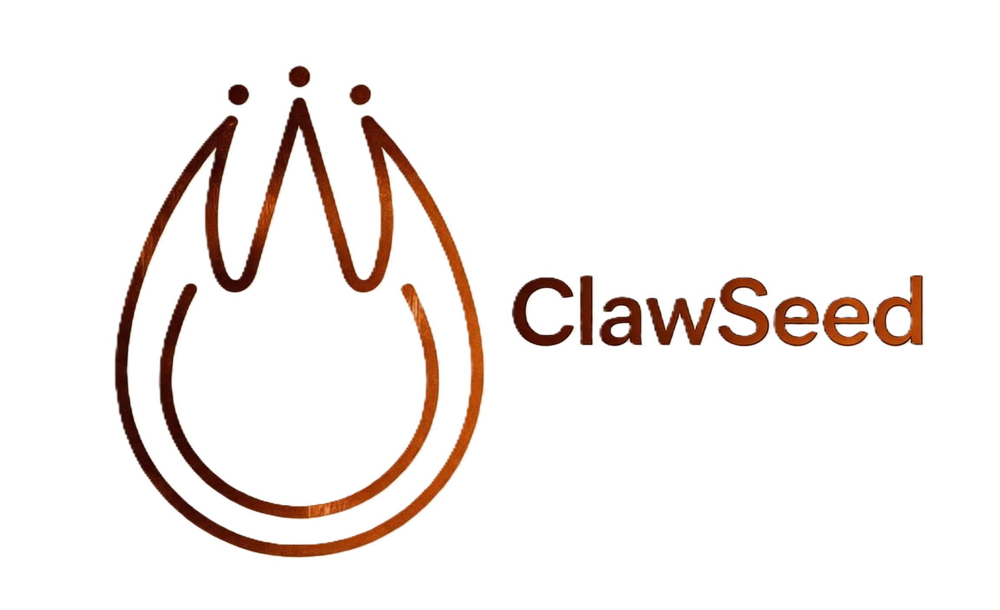

<p align="center">
  
</p>


<p align="center">
  <strong>支持远程工具调用的 Rust AI Agent 运行时。</strong>
</p>

<p align="center">
  <a href="LICENSE-MIT"></a>
  <a href="https://www.rust-lang.org"></a>
  <a href="https://github.com/lzx1413/clawseed/actions/workflows/ci.yml"></a>
  <a href="README.md">English</a> | <strong>中文</strong>
</p>

---

ClawSeed 是一个 AI Agent **运行时**，用 Rust 编写。它连接 LLM 提供商（Anthropic、Gemini、Bedrock、DeepSeek、OpenAI 兼容接口等），通过可插拔的工具执行操作，并通过 HTTP/WebSocket 服务客户端。它附带一个 Android Demo 应用，可在设备上运行完整的 Agent 栈。

一个 agent 运行时应该只做三件事：接收消息、调用 LLM、执行工具。其他一切——渠道、面板、集成——都属于应用层。ClawSeed 提供稳定的 trait crate，应用自己组装。

```toml
# 一个 Discord 机器人应用
[dependencies]
clawseed-agent = "0.7"
clawseed-providers = "0.7"
serenity = "0.12"          # 应用自己选择 SDK

# 一个 Android 应用
[dependencies]
clawseed-gateway = "0.7"
clawseed-agent = "0.7"

# 一个 CLI 工具
[dependencies]
clawseed-agent = "0.7"
clawseed-tools = "0.7"
```

Agent 运行在服务端，但移动客户端（Android、iOS）可以通过 WebSocket 注册自己的工具。当 Agent 调用这些工具时，网关将请求转发给客户端执行。这使得 Agent 可以访问设备能力——通讯录、摄像头、传感器——而无需在服务端编写设备特定代码。

ClawSeed 的 trait 驱动架构借鉴自 [ZeroClaw](https://github.com/zeroclaw-labs/zeroclaw)，但定位不同：ZeroClaw 把渠道、面板、硬件、SOP 引擎都塞进一个二进制（做的是应用）；ClawSeed 提供 crate 让应用自己组装（做的是运行时）。ClawSeed 还新增了 Android Demo 应用、扩展思维链支持和模块化 prompt 构建器，这些是 ZeroClaw 没有的。

## 架构

```
┌──────────────────────────────────────────────────────────┐
│                  gateway (REST / WebSocket)               │
│                       ↓                                   │
│  ┌──────────────────────────────────────────────────┐    │
│  │              Agent (稳定核心)                      │    │
│  │     turn → LLM → dispatch → execute → loop       │    │
│  └──┬──────────┬──────────┬──────────┬─────────────┘    │
│     │          │          │          │                    │
│  provider    tools      memory    hooks                  │
│  (dyn)     (dyn)       (dyn)    (pipeline)               │
│     │          │          │          │                    │
│  Anthropic   25+        SQLite   security                │
│  Gemini      内置       向量搜索  audit                   │
│  Bedrock                search   approval                │
│  OpenAI*     + remote ──→ 移动客户端                     │
│  Ollama                                                  │
│  DeepSeek                                                │
│  Groq                                                    │
└──────────────────────────────────────────────────────────┘
   * 及任何 OpenAI 兼容接口
```

依赖流是单向的：**api ← agent ← tools / providers / memory ← gateway**。没有反向依赖。注意：运行时 `Agent::from_config_with_registry()` 直接实例化 provider、memory 和 tools——agent crate 不只是纯编排层，还承担运行时装配职责。在网关中，`Agent::from_config_with_shared_components()` 复用 `AppState` 的共享组件（provider、memory、observer），避免每个连接重复创建。

## 远程工具调用

移动客户端通过 WebSocket 连接时注册工具规格。网关将每个规格包装为 `RemoteTool`——一个 `Tool` trait 实现，将执行桥接到客户端：

```
┌──────────────┐     register_tools       ┌──────────────┐
│   移动客户端  │ ───────────────────────→ │    网关      │
│              │                          │              │
│              │ ←── tool_call_request ── │   Agent      │
│  (设备端执行) │ ──── tool_result ──────→ │   像调用     │
│              │                          │   普通工具   │
│              │ ←── result_acknowledged─ │   一样调用   │
└──────────────┘                          └──────────────┘
```

流程：

1. 客户端连接并发送 `register_tools`，包含工具规格（名称、描述、JSON Schema）
2. 网关为每个规格创建 `RemoteTool`，注册到共享 `AppState.tool_registry`（用于 `/api/tools` 可见性），并注入到当前连接 Agent 的工具注册表（用于实际执行）
3. Agent 调用工具；`RemoteTool::execute()` 通过 WebSocket 向客户端发送 `tool_call_request`
4. 客户端本地执行，以 `tool_result` 或 `tool_error` 响应
5. 网关通过 call ID 关联回调（30 秒超时），将结果返回给 Agent
6. 连接断开时，网关通过 `unregister_by_source()` 从共享注册表中移除该会话的远程工具

Agent 循环对远程和本地工具没有分支——两者实现同一个 `Tool` trait。远程工具不使用 `ToolContext`（无法访问服务端的内存、安全策略等能力）。

> **注意：** 运行时存在两个独立的工具注册表——`AppState.tool_registry`（网关级，用于 `/api/tools` 端点可见性）和 `Agent.tool_registry`（连接级，用于实际工具调度）。在单连接场景下两者保持同步，但多连接并发时 `/api/tools` 可能显示当前 Agent 无法实际调用的工具。

### Android SDK

```kotlin
val client = ClawseedClient(
    gatewayUrl = "ws://localhost:3000/ws/chat",
    tools = listOf(
        ToolSpec("local_contacts", "查询手机通讯录", contactsSchema),
        ToolSpec("camera", "拍照", cameraSchema),
    )
) { request ->
    when (request.name) {
        "local_contacts" -> ToolCallResult.Success(queryContacts(request.args))
        "camera" -> ToolCallResult.Success(takePhoto(request.args))
        else -> ToolCallResult.Failure("unknown tool")
    }
}
client.connect()
```

SDK 还将网关二进制作为前台服务运行在设备上——整个 Agent 栈运行在 Android 设备上，通过网络访问 LLM 提供商。

### Android Demo 应用

[`clients/android/`](clients/android/) 目录包含一个完整功能的 Android 聊天客户端。它在设备本地运行 clawseed gateway（编译为 `.so`），提供：

- 实时流式对话，支持 Markdown 渲染（标题、代码块、表格、加粗/斜体）
- 扩展思维链展示——可折叠卡片显示模型的推理过程
- 会话管理（创建、恢复、重命名、删除、自动命名）
- 重新生成——一键重新生成最后一条助手响应
- 设备端工具：`device_info`、`get_location`（WGS84 转 GCJ-02 + 逆地理编码）
- 定时后台任务——基于 AlarmManager 的定时提示，支持每日/工作日/单次模式
- Soul 自定义——应用内人格编辑器，编辑工作区 SOUL.md
- 外观设置——浅色/深色/跟随系统主题，支持 OLED 模式
- LLM 配置界面，内置 11 个提供商预设（DeepSeek、Qwen、OpenAI、Anthropic、Ollama 等）
- Thinking Mode 开关，支持扩展思维链模型（如 DeepSeek V4）
- Debug 模式查看完整 LLM prompt 和 token 估算

详见 [`clients/android/README_zh.md`](clients/android/README_zh.md)。

## Crate 组成

| Crate | 职责 | 依赖 api | 依赖 agent |
|-------|------|:-:|:-:|
| `clawseed-api` | 仅 trait 定义 | — | — |
| `clawseed-agent` | Agent 循环、Hook、分发、解析、运行时装配 | 是 | — |
| `clawseed-tools` | 25+ 内置工具 | 是 | 否 |
| `clawseed-providers` | LLM 提供商实现 | 是 | 否 |
| `clawseed-memory` | SQLite 存储 + 向量搜索 | 是 | 否 |
| `clawseed-config` | TOML 配置 schema 与加载 | 是 | 否 |
| `clawseed-gateway` | Axum HTTP/WS 服务器 + 远程工具桥接 | 是 | 是 |
| `clawseed` | 二进制（CLI） | — | — |

## 快速开始

```bash
git clone https://github.com/lzx1413/clawseed.git
cd clawseed
cargo build --release

# 启动网关（HTTP/WebSocket 服务器，供移动客户端连接）
./target/release/clawseed gateway --host 0.0.0.0 --port 3000

# 或启动本地交互式对话（无需启动服务器）
./target/release/clawseed chat
./target/release/clawseed chat --model gpt-4o --temperature 0.5

# 构建并安装 Android Demo 应用（需要 NDK）
./tools/build-clawseed-android.sh aarch64 build
cd clients/android && ./gradlew assembleDebug
adb install -r app/build/outputs/apk/debug/app-debug.apk
```

两种模式都读取 `~/.clawseed/config.toml`。最小配置：

```toml
[providers.models.default]
provider = "anthropic"
model = "claude-sonnet-4-20250514"
api_key = "${ANTHROPIC_API_KEY}"

[agent]
workspace_dir = "/home/user/workspace"
```

## 扩展 ClawSeed

### 添加工具

在 `clawseed-tools` 中实现 `Tool` trait，注册到 `all_tools()`：

```rust
pub struct MyTool;

impl Tool for MyTool {
    fn name(&self) -> &str { "my_tool" }
    fn description(&self) -> &str { "做些有用的事" }
    fn parameters_schema(&self) -> Value { /* JSON Schema */ }
    async fn execute(&self, args: Value, ctx: &dyn ToolContext) -> Result<ToolResult> {
        let workspace = ctx.workspace_dir();
        // ...
    }
}
```

### 添加 Hook

实现 `Hook` trait 拦截工具调用：

```rust
pub struct AuditHook;

impl Hook for AuditHook {
    fn before_tool_call(&self, call: &mut ToolCall) -> HookResult {
        log::info!("工具 {} 被调用", call.name);
        HookResult::Continue
    }

    fn after_tool_call(&self, result: &ToolExecutionResult) -> HookResult {
        log::info!("工具 {} → {:?}", result.name, result.status);
        HookResult::Continue
    }
}
```

`HookResult` 有三个变体：`Continue`（继续）、`Cancel(String)`（取消）、`Modify(ToolCall)`（修改）。

### 添加提供商

在 `clawseed-providers` 中实现 `Provider` trait，加入工厂函数。支持原生工具调用、流式输出、视觉理解和提示缓存。

### 添加 Hook

**文件操作** — 读取、写入、编辑、glob 搜索、内容搜索
**网络** — HTTP 请求、网页抓取、网页搜索（DuckDuckGo）
**记忆** — 存储、回忆、遗忘、清除、导出
**自动化** — 定时任务增删查改执行
**开发** — Shell、Git 操作、PDF 读取
**工具** — 计算器、LLM 子任务、知识库、模型路由、备份

Agent 不需要的工具通过配置中的 `allowed_tools` 排除——不会注册，不消耗 token。

## 安全

- **自主级别** — `ReadOnly` / `Supervised` / `Full`，按部署配置
- **SecurityPolicy** — 实现 `Hook` trait 在工具执行前全局拦截
- **命令白名单** — SecurityPolicy 中的 `allowed_commands` 验证 Shell 命令
- **路径守卫** — `forbidden_path_argument()` 阻止敏感路径（`/etc/passwd`、`/root/.ssh` 等）
- **频率限制** — `max_actions_per_hour` 限制每会话总操作数
- **Hook 管道** — `Hook::before_tool_call()` 可在执行前取消或修改任何工具调用

## 设计原则

1. **显式优于隐式** — `all_tools()` 列出每个工具，能力集一目了然
2. **声明式优于命令式** — 配置驱动组合，而非代码修改
3. **边界用 trait** — 核心依赖抽象，实现在外部
4. **优雅降级** — 能力缺失 → 工具跳过该功能；内存失败 → NoneMemory 回退；提供商不稳 → ReliableProvider 重试

## 致谢

ClawSeed 的 trait 驱动架构和 Provider/Tool/Memory 抽象模式源自 [ZeroClaw](https://github.com/zeroclaw-labs/zeroclaw)。

根本区别在于定位：ZeroClaw 是一个应用（渠道、面板、硬件、SOP 塞进一个二进制）；ClawSeed 是一个运行时（提供 crate 让应用自己组装）。这意味着：

- 不捆绑渠道——应用自己集成消息 SDK
- 不捆绑面板——应用自己构建 UI（如 Android Demo 应用）
- 新增原生远程工具调用，支持移动客户端
- 新增统一的 `Hook` trait 拦截工具调用
- 新增 `ProviderFactory` 注册机制，支持按平台裁剪提供商（Android/嵌入式）
- 新增扩展思维链支持，推理内容在工具调用中完整传递
- 新增 Android Demo 应用，整个 Agent 栈运行在设备上

## 许可证

双重许可：[MIT](LICENSE-MIT) 或 [Apache 2.0](LICENSE-APACHE)，可任选其一。
