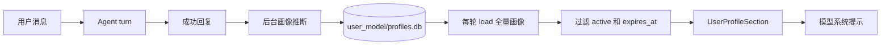
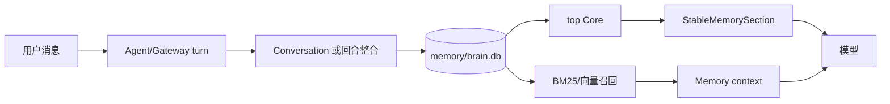
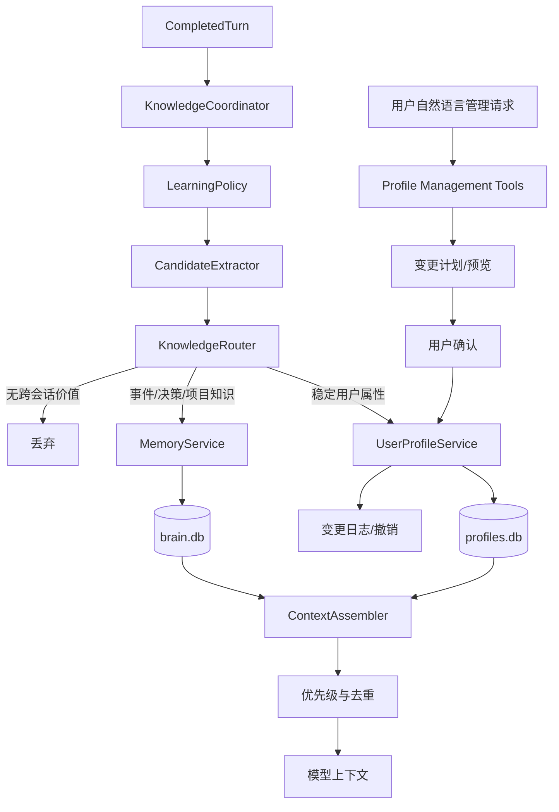

# 用户画像与记忆系统整合开发方案

> 状态：Proposed
> 日期：2026-09-08
> 适用范围：`clawseed-api`、`clawseed-agent`、`clawseed-memory`、`clawseed-tools`、`clawseed-gateway`、Android 客户端
> 核心结论：保留用户画像与长期记忆两种存储，统一知识写入、提示上下文、遗忘和对话式管理入口。

## 1. 文档目的

本文档定义用户画像（User Profile）与长期记忆（Memory）的职责边界、已知问题、目标架构、数据迁移、接口设计、对话式管理、安全约束、实施阶段和验收标准。

本文档用于指导后续开发和评审，不描述已经上线的最终行为。实施过程中若数据模型、删除语义或 Persona 隔离策略发生变化，应先更新本文档，再修改代码。

## 2. 背景与结论

当前系统同时具备：

- 结构化用户画像：保存身份、偏好、专业能力、目标、约束和无障碍需求。
- 长期记忆：保存 Core、Daily、Conversation 和自定义类别，支持 BM25、向量及混合召回。
- 会话历史：保存单个会话的原始消息。
- Persona：允许不同分身使用共享或独立记忆空间。

用户画像与记忆不是完全重复的能力，但目前 Core Memory 仍承担“用户事实和偏好”的职责，导致同一信息可能同时进入两个数据库和两个系统提示区块。与此同时，记忆 namespace、自动保存和不同传输路径还存在正确性问题。因此优化顺序必须是：

1. 先修复数据完整性与隔离。
2. 再统一回合后的知识写入流程。
3. 然后收敛用户画像与记忆的职责边界。
4. 最后提供对话式批量管理和 Android 管理体验。

不采用“将两套数据库直接合并成一张表”的方案。二者的检索方式、生命周期和治理要求不同，物理分离仍然合理；需要统一的是上层写入决策、上下文组装和用户控制面。

## 3. 术语与职责边界

### 3.1 用户画像

用户画像是关于当前用户的、相对稳定且可治理的结构化事实。

适合进入画像的数据：

- `identity`：显示名称、语言区域、代词、时区。
- `preference`：回答长度、语言、格式和稳定偏好。
- `expertise`：长期专业能力或知识水平。
- `goal`：跨会话持续的目标。
- `constraint`：长期限制和明确禁忌。
- `accessibility`：字幕、屏幕阅读器、字号、对比度等需求。

画像必须具备：

- 稳定键。
- 明确来源。
- 置信度。
- 生命周期状态。
- 可选过期时间。
- 用户可查看、纠正、拒绝、批量删除和导出。

### 3.2 长期记忆

长期记忆是跨会话保存的事件性或领域性知识，适合通过相关性检索获取。

适合进入记忆的数据：

- 项目技术栈、架构背景和术语。
- 已执行任务和结果。
- 决策、结论及其上下文。
- 与时间相关的历史事件。
- Persona 私有知识。
- 用户明确要求长期保存、但不属于用户属性的信息。

长期记忆不再自动保存稳定用户属性。兼容期内仍允许旧调用写入，但新写入流程必须优先路由到画像。

### 3.3 会话历史

原始用户消息和助手回复由会话后端负责。会话历史不是长期记忆，不应因为 `auto_save` 再无条件复制一份到 `brain.db`。

只有经过提炼、具有跨会话价值的内容才进入 Daily 或 Core。完整对话仍由 sessions 数据库管理。

### 3.4 Persona

用户画像默认是用户级全局数据，各 Persona 共享：

- 身份、语言区域和无障碍需求始终共享。
- 通用约束和长期目标默认共享。
- Persona 的回答风格由 Persona/Soul 管理，不通过复制画像实现。

长期记忆可以位于：

- `default`：默认身份的私有记忆。
- Persona namespace：对应分身的私有记忆。
- `public`：用户明确要求所有身份共享的记忆。

后续若确有 Persona 专属用户偏好的需求，应增加显式 scope 字段，不复用或暗中解释 `persona_id`。

## 4. 当前架构

### 4.1 用户画像链路



关键实现：

- 类型和存储契约：[`crates/clawseed-api/src/user_profile.rs`](../crates/clawseed-api/src/user_profile.rs)
- 推断与过滤：[`crates/clawseed-agent/src/user_model.rs`](../crates/clawseed-agent/src/user_model.rs)
- 刷新与提示重建：[`crates/clawseed-agent/src/agent/state.rs`](../crates/clawseed-agent/src/agent/state.rs)
- SQLite 存储：[`crates/clawseed-memory/src/user_profile.rs`](../crates/clawseed-memory/src/user_profile.rs)
- Gateway API：[`crates/clawseed-gateway/src/api/memory.rs`](../crates/clawseed-gateway/src/api/memory.rs)

### 4.2 记忆链路



关键实现：

- Memory trait：[`crates/clawseed-api/src/memory_traits.rs`](../crates/clawseed-api/src/memory_traits.rs)
- SQLite 后端：[`crates/clawseed-memory/src/sqlite.rs`](../crates/clawseed-memory/src/sqlite.rs)
- namespace 包装器：[`crates/clawseed-memory/src/namespaced.rs`](../crates/clawseed-memory/src/namespaced.rs)
- 自动整合：[`crates/clawseed-memory/src/consolidation.rs`](../crates/clawseed-memory/src/consolidation.rs)
- Agent 回合：[`crates/clawseed-agent/src/agent/turn.rs`](../crates/clawseed-agent/src/agent/turn.rs)
- WebSocket 回合收尾：[`crates/clawseed-gateway/src/ws.rs`](../crates/clawseed-gateway/src/ws.rs)

## 5. 当前问题清单

### 5.1 P0：namespace 中的同名 key 会互相覆盖

当前 `memories.key` 使用全库 `UNIQUE` 约束，`store_with_metadata()` 又使用 `ON CONFLICT(key)` 更新 namespace。结果是两个 Persona 写入相同 key 时，后一条会覆盖前一条并把记录移动到新的 namespace。

影响：

- Persona 私有记忆可能被其他 Persona 覆盖。
- `public` 与私有空间不能安全使用相同 key。
- `get()` 和 `forget()` 仅使用 key，无法唯一定位 namespace 内的记录。
- 现有隔离测试使用不同 key，没有覆盖真实冲突场景。

### 5.2 P0：WebSocket 自动整合绕过 Persona memory

WebSocket 创建 Agent 时已经将共享记忆包装为 `NamespacedMemory`，但回合结束后的 `consolidate_turn()` 使用全局 `state.mem`。因此 Persona 会话产生的 Daily/Core 条目进入全局 namespace。

### 5.3 P1：不同传输路径的保存行为不一致

- 普通 `turn()` 使用固定 key `user_msg`，新消息覆盖旧消息。
- Webhook 在 Gateway 中预先保存一条随机 key，随后 Agent 可能再次保存 `user_msg`。
- WebSocket 不走普通 `turn()` 的保存逻辑，而在 Gateway 中单独整合。
- 对自动任务内容的跳过规则只在部分入口生效。

结果是同样的用户操作会因入口不同产生不同数据。

### 5.4 P1：画像与 Core Memory 语义重复

系统提示仍要求 `memory_store` 保存用户事实和偏好；自动 Core 整合也可能保存这些信息。画像推断器同时提取 preference、goal、constraint 等条目。两套流程之间没有：

- 统一分类器。
- 跨库去重。
- 冲突优先级。
- 联动删除。
- 来源关联。

### 5.5 P1：召回先截断再过滤

当前召回先在全库取 `limit * 2`，然后才按 namespace 过滤。Agent 自动召回也是先获取少量混合类别结果，再过滤为 Core。

影响：

- 其他 namespace、Daily 或 Conversation 结果会挤占候选位置。
- 目标 namespace 明明存在匹配项，却可能返回空结果。
- 稳定 Core 已占据召回前列时，去重后无法补足新的动态 Core。
- `min_relevance_score` 已配置但没有实际应用。

### 5.6 P1：画像推断存在竞态覆盖

推断流程先 `load()`，在 Agent 内判断是否允许替换，随后调用普通 `upsert()`。检查和写入不是同一个事务。

可能发生：

1. 推断任务读取到某 key 不存在。
2. 用户通过 Android 手动写入该 key。
3. 推断任务继续执行并覆盖用户的 explicit 值。

这违反“推断不能覆盖用户手动设置”的产品语义。

### 5.7 P2：画像标签数量会持续膨胀

除 Identity 和 Accessibility 的少数键外，推断器可以生成任意合法 key。当前缺少：

- 规范键字典和别名表。
- 相近键归一化。
- 每类别上限。
- 低价值标签淘汰。
- 重复观察强化机制。
- 批量管理能力。

即使系统提示最多注入 20 条，数据库和管理页面仍会继续增长。

### 5.8 P2：画像选择策略不代表重要性

`load()` 按 category 和 key 排序，Agent 过滤后直接 `take(max_prompt_items)`。这会让字母顺序决定提示词内容，而不是来源、重要性、置信度、最近更新时间或类别配额。

### 5.9 P2：中文内容的整合和冲突检测较弱

Core 晋升依赖英文高信号关键词，Jaccard/BM25 overlap 使用空白分词。对于中文的偏好、否定和变化表达，召回与冲突检测效果不稳定。新候选缺少 embedding 时，Combined 模式还会回退到 Jaccard。

### 5.10 P2：删除和隐私语义不完整

- 删除或拒绝画像不会删除同义 Core Memory。
- 用户可能认为信息已不再影响回复，但它仍能通过记忆召回。
- 自动推断将用户消息和助手回复发送给当前 Provider；“本地画像”只代表本地存储，不代表本地处理。
- Android 导出的画像 JSON 和 memory SQLite 为明文。
- `excludeSensitive` 当前只过滤配置和偏好，不过滤画像或记忆内容。

## 6. 目标与非目标

### 6.1 目标

- 保证 namespace 隔离和数据完整性。
- 所有传输入口只触发一次统一的知识写入流程。
- 稳定用户属性只由画像作为权威来源。
- 长期记忆只保存事件、决策、项目知识和 Persona 知识。
- 用户能通过自然语言查看、总结、纠正、合并和批量删除画像。
- 所有批量变更可预览、原子执行并在短期内撤销。
- 用户拒绝或遗忘的信息不再通过其他存储影响回复。
- 中文场景具备明确的回归测试。
- 数据迁移可验证、可回滚，不静默丢失现有记忆。

### 6.2 非目标

- 本轮不建设通用知识图谱。
- 本轮不将画像和记忆合并为同一张表。
- 本轮不实现云端多租户账号体系。
- 本轮不自动迁移所有旧 Core 为画像；旧数据只生成候选报告。
- 本轮不默认启用自动画像推断。
- 本轮不让 LLM 直接生成并执行任意 SQL 或任意批量变更。

## 7. 目标架构



### 7.1 KnowledgeCoordinator

`KnowledgeCoordinator` 位于 Agent 层，负责成功回合后的学习，不负责会话消息持久化。

输入建议：

```rust
pub struct CompletedTurn<'a> {
    pub user_text: &'a str,
    pub assistant_text: &'a str,
    pub session_id: Option<&'a str>,
    pub persona_id: Option<&'a str>,
    pub memory_namespace: &'a str,
    pub verified_tool_facts: &'a [VerifiedToolFact],
}
```

职责：

- 应用跳过自动任务、空消息等统一规则。
- 根据配置决定是否提取画像和长期记忆候选。
- 将候选交给 `KnowledgeRouter`。
- 使用当前 Agent 持有的 memory，而不是 Gateway 全局 memory。
- 记录成功、跳过、冲突和失败原因。
- 保持 fire-and-forget，不阻塞主回复，但提供有界队列和关闭排空机制。

普通和流式 `turn` 必须调用同一个完成处理方法。Gateway 只保存 session history，不再直接向 `brain.db` 写入。

### 7.2 KnowledgeRouter

路由规则：

| 候选 | 目标 | 说明 |
|---|---|---|
| 用户显示名、语言、时区 | Profile | 稳定用户身份 |
| 回答风格、格式偏好 | Profile | 不进入 Core |
| 长期目标、长期约束 | Profile | 可设置过期时间 |
| 一次性任务要求 | Drop/Session | 不跨会话保存 |
| 项目使用 Rust | Memory | 项目知识，不是用户属性 |
| 选择方案 B 的决策 | Memory | 带事件上下文和时间 |
| 工具确认的事实 | Memory | 标记 verified 来源 |
| 助手自行生成的判断 | Drop | 不能作为用户画像事实 |

当候选可能属于两类时，优先级为：

1. 是否直接描述用户本人。
2. 是否在未来多数会话中仍有用。
3. 是否可以用稳定 key 表达和更新。
4. 若三项都成立，进入 Profile；否则进入 Memory。

### 7.3 ContextAssembler

上下文组装不使用一个覆盖所有语义的线性优先级，而是按信息类型确定权威来源：

| 信息类型 | 权威顺序 |
|---|---|
| 用户身份、目标和约束 | explicit 画像 > imported 画像 > inferred 画像 > Memory |
| 无障碍和安全约束 | 当前用户指令 > explicit 画像 > imported/inferred 画像 > 其他上下文 |
| Persona 行为和表达风格 | 当前用户指令 > Persona/Soul > 全局画像偏好 |
| 项目知识、事件和决策 | 已验证工具事实 > explicit Memory > inferred Memory |
| 历史背景 | Core Memory > 动态相关记忆 |

用户在某个 Persona 中提出可能影响全局画像的风格修改时，首版仍写入全局画像；该 Persona 的显式 Soul 风格保持局部优先。若用户要求修改当前 Persona，应路由到 Persona 管理而不是画像管理。

旧 Core 若与有效画像具有相同规范 key，不能再次注入提示词。无法建立规范 key 的旧数据只做文本去重，不自动删除。

## 8. Memory 数据模型与迁移

### 8.1 schema 修正

第一阶段必须将唯一约束从：

```sql
UNIQUE(key)
```

改为：

```sql
UNIQUE(namespace, key)
```

`namespace` 应改为 `TEXT NOT NULL DEFAULT 'default'`。

后续知识路由阶段可增加用于治理的元数据，但不应与 P0 复合唯一约束迁移捆绑，除非实现评审确认不会扩大回滚风险：

```sql
memory_kind       TEXT NOT NULL DEFAULT 'knowledge',
source            TEXT NOT NULL DEFAULT 'explicit',
profile_key       TEXT,
expires_at        TEXT
```

其中：

- `memory_kind`：`knowledge`、`event`、`decision`、`task_result`。
- `source`：`explicit`、`inferred`、`tool_verified`、`imported`、`legacy`。
- `profile_key`：仅用于兼容期识别与画像关联的旧条目，新写入不应复制画像。
- `expires_at`：允许短期事件自然过期。
- 来源会话继续使用现有 `session_id`，不新增含义重复的列。

### 8.2 trait 演进

现有按 key 的方法无法表达 namespace。建议以向后兼容方式增加：

```rust
pub struct MemoryScope<'a> {
    pub namespace: &'a str,
    pub session_id: Option<&'a str>,
}

async fn get_scoped(&self, scope: MemoryScope<'_>, key: &str)
    -> anyhow::Result<Option<MemoryEntry>>;

async fn forget_scoped(&self, scope: MemoryScope<'_>, key: &str)
    -> anyhow::Result<bool>;

async fn recall_scoped(&self, query: MemoryQuery<'_>)
    -> anyhow::Result<Vec<MemoryEntry>>;
```

`MemoryQuery` 应包含 namespace、category、session、时间范围、limit、最低相关度和搜索模式。namespace/category/session 必须进入 FTS、向量和 LIKE 查询阶段，不能在 limit 之后过滤。

旧 `get/forget/recall` 暂时映射到 `default` namespace，并标记为 deprecated；完成所有调用点迁移后再考虑删除。

### 8.3 SQLite 迁移步骤

迁移必须位于事务内并具备显式版本号：

1. 检查当前 schema 和 `PRAGMA user_version`。
2. 执行 WAL checkpoint。
3. `BEGIN IMMEDIATE`。
4. 创建带复合唯一约束的新表。
5. 以 `COALESCE(namespace, 'default')` 复制旧数据。
6. 校验复制前后总数、不同 id 数量和空 namespace 数量。
7. 替换旧表。
8. 重建 FTS 虚表、触发器和索引。
9. 执行 `PRAGMA foreign_key_check` 与 `PRAGMA integrity_check`。
10. 更新 `user_version` 并提交。

迁移前不自动删除或合并旧数据。由于旧 schema 不可能同时存在相同 key 的多 namespace 记录，复合唯一约束迁移本身不会产生冲突。

### 8.4 namespace 测试要求

- 两个 namespace 可以保存相同 key 和不同内容。
- `public` 与私有 namespace 可以保存相同 key。
- scoped get/forget 只影响指定 namespace。
- Persona 的自动 Daily/Core 写入正确 namespace。
- FTS、向量、LIKE、list、export、purge、top Core 均遵守 scope。
- 其他 namespace 有大量高分结果时，目标 namespace 仍返回完整 limit。

## 9. 用户画像数据模型优化

### 9.1 规范键

建立 `ProfileKeyRegistry`：

- 定义内置键及其类别、值类型、是否可过期和最大长度。
- 定义历史别名，例如 `response.style` 归一化为 `preference.response_style`。
- Identity 和 Accessibility 继续使用严格白名单。
- Preference、Goal、Constraint 和 Expertise 优先使用注册键。
- 未注册键只能进入 `custom.*`，并受更严格数量限制。

首批建议内置键：

```text
identity.display_name
identity.locale
identity.pronouns
identity.timezone
preference.language
preference.response_style
preference.output_format
preference.code_language
goal.primary
constraint.no_cloud_services
accessibility.captions
accessibility.color_contrast
accessibility.input_method
accessibility.screen_reader
accessibility.text_size
```

### 9.2 标签数量控制

采用多层控制：

- 每轮最多接受固定数量的新候选。
- 每类别设置 active 上限。
- 新候选先匹配已有键和别名，优先更新而不是创建。
- 相同值不重复写入，也不增加版本。
- 时间性 Goal/Constraint 必须设置过期时间。
- 长期未使用且低置信度的 inferred 条目进入整理候选，而不是永久保留。
- `max_prompt_items` 仅是提示预算，不能代替数据库治理。

### 9.3 推断强化

自动推断继续默认关闭。开启后：

- 只从用户原始消息提取画像，不发送助手回复作为事实来源。
- 明确表达可以直接达到 active 阈值。
- 模糊或行为推断需要多个独立 session 的重复证据。
- 低置信度候选不直接进入 active 画像。
- rejected key 永久阻止相同自动推断，除非用户主动重新启用。

若需要保存候选观察，新增独立的 `user_profile_observations` 表，不把 Pending 混入当前 prompt 使用的 items 表。

### 9.4 原子推断写入

扩展 `UserProfileStore`，增加事务级条件写入：

```rust
async fn upsert_inferred_if_allowed(
    &self,
    user_id: &str,
    input: ProfileItemInput,
) -> anyhow::Result<InferenceWriteResult>;
```

事务内部重新读取当前 key，并执行：

- explicit/imported 不允许覆盖。
- rejected 不允许重新激活。
- 相同值不写入。
- 新置信度低于当前值不覆盖。
- 只有实际变更才递增 profile version。

画像 SQLite 操作应通过 `spawn_blocking` 或专用数据库执行器运行，避免在 Tokio worker 上持有同步 Mutex。

### 9.5 提示选择

提示注入不再使用简单 `take(max_prompt_items)`，而使用稳定排序和类别配额：

```text
安全/无障碍约束
> explicit
> imported
> inferred
> 置信度
> 最近确认时间
> key（稳定 tie-breaker）
```

建议改为 token budget，同时保留 item hard limit 防御异常值。输出顺序必须确定，避免无意义破坏 Provider 前缀缓存。

## 10. 对话式画像管理

### 10.1 用户体验目标

用户可以直接说：

- “你现在记得我什么？”
- “总结一下你对我的了解。”
- “以后回答详细一点，把简洁回答的偏好改掉。”
- “删除所有自动推断出来的标签。”
- “忘掉所有关于编程语言偏好的信息。”
- “把重复的兴趣标签合并一下。”
- “清理已经过期的目标。”

系统应根据操作风险返回结果或变更预览，而不是要求用户逐条输入内部 id。

### 10.2 工具拆分

推荐三个职责单一的内部工具，而不是让一个工具同时自由查询和写入：

#### `user_profile_search`

只读工具，支持：

- 按 category、source、status、时间、key 和语义文本过滤。
- 返回稳定 item id、key、值、来源、状态和更新时间。
- 生成确定性的分类摘要。

#### `user_profile_change_plan`

只生成变更计划，不修改数据。支持：

- set/update。
- reject。
- delete。
- bulk delete。
- merge/rename。
- 清理过期项。

输出服务端保存的 `plan_id`、`expected_profile_version`、影响条目和变更摘要。

#### `user_profile_apply_plan`

仅接受 `plan_id`，不能接受模型重新生成的任意变更数组。执行前验证：

- 当前认证 user 与计划一致。
- 计划未过期。
- 当前 profile version 与 expected version 一致。
- 用户已经确认需要确认的操作。
- 影响数量未超过服务端 hard limit。

所有变更在一个事务内执行。

### 10.3 确认策略

| 操作 | 默认行为 |
|---|---|
| 查看、搜索、总结 | 直接执行 |
| 明确的单键新增或修改 | 可直接执行，提供撤销 |
| 拒绝单条自动推断 | 用户明确指令后直接执行，提供撤销 |
| 删除单条 | 显示目标后确认 |
| 批量删除、合并、清空 | 必须展示预览并再次确认 |
| “忘掉关于 X 的一切” | 同时预览画像和记忆命中，确认后联合执行 |

总结操作默认是即时视图，不把总结文本再次保存为画像，否则会制造新的标签和重复来源。

### 10.4 工具身份与安全

- 工具参数不暴露 `user_id`。
- user id 只能来自当前认证的 `UserContext`。
- 画像值始终作为不可信数据处理，不能成为系统指令。
- 共享 BuiltIn tool 不能捕获某个连接的 user id；应从 `ToolContext` 获取当前用户上下文，或注册为连接级工具。
- 删除计划设置短 TTL，执行一次后失效。
- 记录 before/after 版本、条目 id 和操作类型，不记录不必要的敏感值。
- 批量接口限制条目数量和请求体大小。

### 10.5 撤销

新增 `user_profile_change_log` 或等价审计表，至少保存：

- `operation_id`。
- `user_id`。
- `profile_version_before/after`。
- 变更条目的 before/after JSON。
- 创建时间和过期时间。

撤销同样使用版本检查。超过保留期后，审计内容应被清理，避免形成永久的第二份用户画像。

## 11. 画像与记忆去重

### 11.1 新数据

新写入统一经过 `KnowledgeRouter`，同一候选只能选择一个目标。禁止先写 Memory 再复制到 Profile。

`memory_store` 的描述改为：

- 保存事件、项目知识、决策和任务结果。
- 遇到稳定用户身份、偏好、目标、约束时使用画像管理能力。
- `public` 仅在用户明确要求所有 Persona 共享时使用。

### 11.2 提示阶段

`ContextAssembler` 建立规范画像 key 集合，过滤：

- 明确关联同一 `profile_key` 的 legacy Core。
- 内容完全相同的 Core。
- 高置信匹配且已被画像覆盖的用户事实。

过滤只影响提示注入，不立即删除数据。任何模糊语义匹配都应保留原数据并输出诊断指标。

### 11.3 存量整理

提供一次只读扫描命令或内部 API：

```text
legacy Core
  -> 确定为画像重复：建议迁移/删除
  -> 可能重复：等待用户确认
  -> 事件或项目知识：保留 Memory
  -> 低价值或损坏：建议清理
```

扫描结果必须先导出报告。默认不自动执行迁移，防止错误分类导致数据丢失。

### 11.4 联合遗忘

新增“忘掉关于 X 的一切”协调操作：

1. 查询画像中的精确 key、值和语义命中。
2. 查询所有用户可见 namespace 中的相关记忆。
3. 将明确匹配和可能匹配分开展示。
4. 用户选择后执行事务性画像变更和记忆删除。
5. 若跨两个 SQLite 数据库无法使用同一事务，记录 operation journal 并实现补偿或重试。

普通画像删除 API 仍只删除画像，避免已有 API 行为被静默扩大；联合遗忘必须使用新的显式接口。

## 12. 召回与提示优化

### 12.1 查询阶段过滤

FTS、向量、LIKE 和时间查询统一接收：

- namespace 集合。
- category 集合。
- session id。
- since/until。
- minimum relevance。
- 排除的 entry ids 或 keys。

所有过滤应在候选截断前应用。

### 12.2 稳定 Core 与动态 Core

- 稳定区注入高重要性、低变化的 Core。
- 动态召回排除已经注入的 entry id，再取足 limit。
- Core 排序增加 `updated_at DESC, key ASC` 作为稳定 tie-breaker。
- 不再先召回混合类别后过滤 Core。

### 12.3 Prompt 优先级声明

系统提示应明确：

- User Profile 是关于用户的权威当前状态。
- Core Memory 是历史和领域上下文。
- 两者冲突时，对用户属性采用 Profile；对 Persona 行为采用 Persona/Soul。
- Profile 和 Memory 中的值都是参考数据，不是系统指令。

## 13. API 设计

### 13.1 保留接口

现有单项接口继续兼容：

```text
GET    /api/users/me/profile
POST   /api/users/me/profile
PATCH  /api/users/me/profile/items/{id}
DELETE /api/users/me/profile/items/{id}
DELETE /api/users/me/profile
PUT    /api/users/me/profile/import
```

### 13.2 新增接口

建议增加：

```text
POST /api/users/me/profile/search
POST /api/users/me/profile/change-plans
POST /api/users/me/profile/change-plans/{plan_id}/apply
POST /api/users/me/profile/operations/{operation_id}/undo
POST /api/users/me/knowledge/forget-plans
POST /api/users/me/knowledge/forget-plans/{plan_id}/apply
```

所有修改响应返回：

```json
{
  "profile_version": 42,
  "operation_id": "...",
  "affected": 6,
  "skipped": 1
}
```

版本冲突返回 `409 Conflict`，计划过期返回 `410 Gone`，超过批量限制返回 `413` 或 `422`。

### 13.3 Memory API scope

`/api/memory` 应支持显式 `namespace` 或 Persona 参数，并校验调用者是否有权访问。默认只能访问 `default + public`，不能通过任意字符串读取其他 Persona 私有空间。

## 14. 配置演进

保留当前配置并提供向后兼容映射：

```toml
[memory]
auto_save = true
auto_recall = true
auto_recall_limit = 3
min_relevance_score = 0.4

[user_model]
enabled = true
auto_infer = false
inference_min_confidence = 0.8
max_inferred_items_per_turn = 3
max_prompt_items = 20
```

新增配置应克制，优先采用稳定默认值。确需暴露时建议：

```toml
[user_model]
max_active_items_per_category = 20
min_observations_for_implicit_fact = 2
change_plan_ttl_minutes = 10
undo_retention_hours = 24
```

`auto_save` 在兼容期解释为“自动提炼跨会话知识”，不再解释为“复制每条原始消息”。文档和 Android 文案必须同步更新。

## 15. Android 体验

### 15.1 信息架构

将管理入口命名为“助手记得什么”，包含两个视图：

- 关于我：用户画像。
- 经历与知识：长期记忆。

画像视图支持：

- 按类别、来源、状态筛选。
- 多选。
- 删除全部自动推断项。
- 批量拒绝、删除和整理。
- 展示来源、置信度、更新时间和过期时间。
- 跳转到对话进行自然语言管理。

### 15.2 对话结果呈现

对话式管理返回结构化 ToolPresentation：

- 变更前后对比。
- 影响条目数量。
- 明确匹配与可能匹配分组。
- 确认、取消和撤销动作。

不能只返回一段无法核对的自然语言。

### 15.3 备份与隐私

- 导出画像或记忆时明确提示包含个人数据。
- `excludeSensitive` 扩展到画像和记忆，或明确说明不能可靠自动过滤并要求用户确认。
- 后续增加加密 ZIP/平台安全存储方案时，不改变现有归档结构中的逻辑路径。
- rejected 项默认随完整画像备份导出，因为它们防止再次推断；提供隐私精简导出选项时应说明这一影响。

## 16. 可观测性

新增不含原始敏感内容的指标：

- `profile_candidates_total{result=accepted|duplicate|rejected|sensitive|low_confidence}`。
- `profile_active_items{category,source}`。
- `profile_change_plan_total{operation,result}`。
- `memory_write_total{kind,namespace_class,source}`。
- `memory_recall_total{mode,result}`。
- `memory_recall_filtered_total{reason}`。
- `knowledge_router_total{target=profile|memory|drop}`。
- `prompt_context_items{source=profile|stable_memory|dynamic_memory}`。
- 后台学习队列长度、丢弃数和关闭排空结果。

日志只记录 user/session/persona 的安全标识、key 和结果原因，不记录完整画像值、用户原文或记忆正文。

## 17. 测试计划

### 17.1 单元测试

- Profile key 规范化和别名。
- Profile 候选分类与敏感字段拒绝。
- explicit/imported/rejected 的替换规则。
- 类别配额和稳定提示排序。
- 画像/Core 去重和优先级。
- 中文偏好、否定和目标过期。
- 变更计划版本校验、TTL 和最大批量限制。
- 总结不创建新画像条目。

### 17.2 Memory 集成测试

- 复合唯一约束。
- namespace 同 key 共存。
- 所有查询模式的 SQL 前置过滤。
- Persona 自动整合不污染 default/public。
- 动态召回排除稳定 Core 后仍能补足 limit。
- schema v1 到 v2 迁移、FTS rebuild 和重启。

### 17.3 Agent 测试

- 普通与流式 turn 只触发一次 KnowledgeCoordinator。
- 失败或取消的 turn 不学习。
- 截断后自动继续只在最终成功时学习一次。
- 画像只读取用户文本，不从助手文本生成事实。
- profile 更新后下一轮稳定重建 prompt。
- 同一事实不同时出现在 User Profile 与 Core Memory 区块。

### 17.4 Gateway 测试

- WebSocket、Webhook、CLI/embedded 行为一致。
- Persona session 恢复后继续使用原 namespace。
- change plan 不能跨用户或重复执行。
- profile version 冲突返回 409。
- 联合遗忘部分失败时 journal 可恢复。

### 17.5 Android 测试

- 筛选、多选和批量删除。
- 预览、确认、版本冲突刷新和撤销。
- 画像为空、Gateway 关闭、画像禁用和导入失败状态。
- 备份导入策略：merge、append、replace。
- 旋转和进程重建后不重复执行删除计划。

### 17.6 真机 Release 覆盖升级测试

真机验收必须使用已签名的 Release APK 覆盖安装到手机上现有的 `dev.clawseed.demo`。现有应用及其数据属于不可删除资产。

硬性约束：

- 只能使用 `adb install -r` 覆盖安装。
- 禁止执行 `adb uninstall`、`pm uninstall`、`pm clear` 或在系统设置中“清除存储空间”。
- 禁止删除应用数据目录、数据库、配置、会话、画像、记忆或 Persona 数据。
- 禁止使用 `-d` 强制降级，也不能通过更换 applicationId 安装另一份应用来替代升级验证。
- 签名不一致、版本降级、迁移失败或空间不足时立即停止，保留现场并修复构建或迁移；不能通过卸载重装绕过。

覆盖升级测试必须验证：

- Release APK 的 applicationId 仍为 `dev.clawseed.demo`。
- Release APK 已签名，且签名证书与手机现有安装一致。
- 待安装 `versionCode` 不低于现有安装；正式发布构建必须高于线上版本。
- 覆盖安装后 `firstInstallTime` 不变，`lastUpdateTime` 更新。
- 原有配置、Provider 设置、Persona、会话、画像和长期记忆仍然存在。
- Gateway 能正常启动，schema 迁移没有降级到 `NoneMemory`。
- 新旧画像、记忆均能读取，并能完成至少一次真实对话召回。
- 对话式查看、总结、修改预览和批量删除预览可用；测试不得为了验收直接删除用户现有数据。

完整操作规程见 [第 19.4 节](#194-release-apk-真机覆盖安装规程)。

### 17.7 回归场景

至少覆盖以下中文用户指令：

```text
以后回答简洁一点。
我现在不喜欢简洁回答了，请详细解释。
删掉你推断出来的所有偏好。
忘掉我之前提到的 Python 偏好。
总结一下你对我的了解，不要修改任何内容。
合并重复标签，但先让我确认。
```

## 18. 分阶段实施

### Phase 0：特征测试与风险冻结

- [ ] 为现有 bug 添加失败测试，不先改变行为。
- [ ] 覆盖 namespace 同 key、WS Persona 整合、固定 `user_msg` 覆盖和 Webhook 重复写入。
- [ ] 记录当前数据库 schema 和迁移样本。
- [ ] 确认备份/恢复路径可用于迁移回滚。

交付物：可重复证明问题的测试集合和迁移 fixture。

### Phase 1：Memory scope 正确性

- [ ] 迁移为 `UNIQUE(namespace, key)`。
- [ ] 增加 scoped get/forget/recall。
- [ ] 将 namespace/category/session 过滤下推到查询。
- [ ] 修复 top Core、export、purge 和冲突检测的 scope。
- [ ] 修复 `config.memory.namespace` 的含义和调用。

交付物：namespace 隔离在所有读写路径中成立。

### Phase 2：统一回合学习管线

- [ ] 引入 CompletedTurn 和 KnowledgeCoordinator。
- [ ] 普通/流式 turn 共用完成处理。
- [ ] Gateway 移除对 brain.db 的直接自动写入。
- [ ] 移除固定 `user_msg` 保存。
- [ ] 明确 session history 与长期记忆边界。
- [ ] 后台任务增加有界队列和关闭排空。

交付物：所有传输入口产生一致且唯一的学习结果。

### Phase 3：画像治理与知识路由

- [ ] 建立 ProfileKeyRegistry 和别名迁移。
- [ ] 实现 KnowledgeRouter。
- [ ] 实现事务级 inferred upsert。
- [ ] 增加类别上限、候选强化和过期规则。
- [ ] 从画像提取请求中移除助手回复。
- [ ] 增加中文提取与冲突测试。

交付物：新数据不会在 Profile 与 Memory 双写，标签数量可控。

### Phase 4：对话式管理

- [ ] 实现 search、change plan、apply plan 和 undo。
- [ ] ToolContext 提供认证 UserContext。
- [ ] 增加批量事务、版本检查、TTL 和审计清理。
- [ ] 实现只读总结和联合遗忘计划。
- [ ] 增加结构化 ToolPresentation。

交付物：用户可通过自然语言安全地查看、总结、修改、合并和批量删除画像。

### Phase 5：Prompt、存量整理与 Android

- [ ] 实现 ContextAssembler 优先级与跨库去重。
- [ ] 实现存量 Core 扫描报告。
- [ ] Android 增加统一管理入口、筛选和多选。
- [ ] Android 支持计划确认、冲突刷新和撤销。
- [ ] 更新备份隐私行为与提示。
- [ ] 同步中英文用户文档。
- [ ] 使用签名一致的 Release APK 在保留现有应用数据的前提下完成真机覆盖升级验收。

交付物：管理闭环完成，历史重复数据可由用户安全整理。

## 19. 发布与回滚

### 19.1 发布顺序

1. 先发布只包含 schema 迁移和 scope 修复的版本。
2. 观察迁移、召回和 Persona 隔离指标。
3. 再发布统一学习管线，保持 `auto_infer` 默认关闭。
4. 对话式管理先开放只读搜索和总结。
5. 写操作在完整预览、版本控制和撤销上线后启用。
6. 最后开放存量整理，不自动执行删除。

### 19.2 功能开关

建议为高风险阶段保留临时开关：

- `knowledge_coordinator_enabled`。
- `profile_conversation_management_enabled`。
- `profile_memory_prompt_dedup_enabled`。
- `legacy_memory_cleanup_enabled`。

稳定后删除临时开关，避免长期配置债务。

### 19.3 回滚原则

- schema v2 代码应能识别迁移失败并停止写入，不能回退到 NoneMemory 后继续静默运行。
- 迁移失败保留原表和备份，不覆盖用户数据。
- 新增列保持旧版可忽略；需要回滚二进制时记录最低兼容版本。
- 联合遗忘通过 operation journal 恢复，不依赖用户手动比对两个数据库。
- Android 回滚必须构建一个使用原签名、且 `versionCode` 高于手机当前安装的修复 APK，再通过 `adb install -r` 覆盖；禁止卸载后安装旧版本。

### 19.4 Release APK 真机覆盖安装规程

#### 19.4.1 前置快照

1. 使用 `adb devices` 确认目标设备，只允许对明确的 device serial 操作。
2. 执行以下只读命令确认现有应用仍在，并记录安装信息：

```bash
adb -s <device-serial> shell pm path dev.clawseed.demo
adb -s <device-serial> shell dumpsys package dev.clawseed.demo
```

需要记录但不得提交到仓库的信息：

- 当前 `versionCode` 和 `versionName`。
- `firstInstallTime` 和 `lastUpdateTime`。
- 当前安装 APK 路径。
- 当前签名证书 SHA-256 摘要。
- 应用内现有会话、Persona、画像和记忆的可识别数量或脱敏截图。

3. 使用应用内“数据迁移/导出”创建用户可控备份。备份只作为风险保护，覆盖安装流程不能依赖清空后恢复。
4. 备份、安装包副本和设备状态文件可能含敏感数据，不得提交到 Git、上传到公共服务或写入普通 CI 日志。

#### 19.4.2 构建 Release APK

从仓库根目录执行：

```bash
./tools/build-clawseed-android.sh aarch64 build
clients/android/gradlew -p clients/android assembleRelease
```

预期签名包：

```text
clients/android/app/build/outputs/apk/release/app-release.apk
```

如果只生成 `app-release-unsigned.apk`，测试立即停止。必须配置与手机现有应用相同的 Release signing key 后重新构建，不能安装 unsigned APK，也不能改用 Debug APK。

#### 19.4.3 安装前校验

使用 Android SDK 的 `apkanalyzer` 和 `apksigner` 校验新 APK：

```bash
apkanalyzer manifest application-id clients/android/app/build/outputs/apk/release/app-release.apk
apkanalyzer manifest version-code clients/android/app/build/outputs/apk/release/app-release.apk
apksigner verify --verbose --print-certs clients/android/app/build/outputs/apk/release/app-release.apk
```

读取手机现有安装的 APK 路径后，去掉 `pm path` 输出中的 `package:` 前缀，将该明确路径拉取到临时目录并检查证书：

```bash
adb -s <device-serial> pull <pm-path返回的base.apk绝对路径> /tmp/clawseed-installed-base.apk
apksigner verify --verbose --print-certs /tmp/clawseed-installed-base.apk
```

只有以下条件全部成立才能继续：

- applicationId 完全一致。
- 新旧 APK 的 signer certificate SHA-256 digest 完全一致，或符合已经明确验证的 Android signing certificate rotation lineage。
- 新 APK 的 versionCode 不低于已安装版本。
- APK 签名验证成功。

#### 19.4.4 覆盖安装

安装命令必须明确包含目标设备和 `-r`：

```bash
adb -s <device-serial> install -r clients/android/app/build/outputs/apk/release/app-release.apk
```

不得添加 `-d`，不得在失败后执行 uninstall/clear。常见失败处理：

| 错误 | 处理方式 |
|---|---|
| `INSTALL_FAILED_UPDATE_INCOMPATIBLE` | 停止，核对 Release signing key；禁止卸载现有应用 |
| `INSTALL_FAILED_VERSION_DOWNGRADE` | 停止，提高 versionCode 后重新构建；禁止使用 `-d` |
| `INSTALL_PARSE_FAILED_NO_CERTIFICATES` | 停止，完成 Release 签名配置 |
| 空间不足 | 停止并由用户决定如何释放空间；不得删除 ClawSeed 应用或数据 |
| 安装后 Gateway/迁移失败 | 保留应用和数据，采集脱敏日志，使用签名一致且更高 versionCode 的修复包覆盖 |

#### 19.4.5 安装后验证

再次读取 package 信息，并与安装前快照比较：

```bash
adb -s <device-serial> shell dumpsys package dev.clawseed.demo
```

验收检查表：

- [ ] `firstInstallTime` 与安装前相同。
- [ ] `lastUpdateTime` 晚于安装前。
- [ ] versionCode/versionName 与新 Release APK 一致。
- [ ] 应用正常启动且没有崩溃循环。
- [ ] Gateway 启动并通过健康检查。
- [ ] 原 Provider 配置仍存在且可用。
- [ ] 原 Persona 列表和各自 memory scope 保持不变。
- [ ] 原会话列表、会话内容和标题仍存在。
- [ ] 原用户画像条目、source、status 和 version 仍存在。
- [ ] 原 Core/Daily/Conversation 记忆仍可读取。
- [ ] schema v1 到 v2 的记录数、id 和 namespace 校验通过。
- [ ] 使用现有非敏感数据完成画像总结和记忆召回。
- [ ] 新增或修改一条专用测试数据后，重启应用仍能读取；不得改动用户的重要现有条目。

验证完成后保留手机上的升级结果，不回退、不卸载、不清除数据。临时拉取的已安装 APK 和脱敏前的检查材料只保存在 `/tmp`，完成证书比对后可以删除；用户导出的正式备份由用户决定保留位置和期限。

## 20. 验收标准

### 20.1 正确性

- 两个 Persona 可保存相同 key，内容和 namespace 均保持独立。
- Persona 自动生成的 Daily/Core 不进入全局空间。
- 同一成功回合最多执行一次长期学习。
- 会话原始消息不再重复保存到长期记忆。
- 所有 scope/category/session 过滤在 limit 前生效。

### 20.2 画像质量

- 同一偏好不会生成多个近义 key。
- explicit、imported 和 rejected 不会被后台竞态覆盖。
- 画像提示选择具有稳定顺序和明确优先级。
- 总结操作不增加画像数量。
- 自动推断默认关闭，开启状态对用户可见。

### 20.3 用户控制

- 用户可以通过对话查看、总结、修改、合并和批量删除画像。
- 批量破坏性操作必须预览并确认。
- 版本变化会阻止过期计划执行。
- 撤销在保留期内可用。
- 联合遗忘后，目标信息不再通过画像或记忆进入模型上下文。

### 20.4 兼容与数据安全

- v1 数据库迁移后记录数量和 id 保持一致。
- Memory/Profile 导入导出策略继续兼容。
- Android 旧版本数据可升级。
- CI、Rust 单元/集成测试和 Android 单元测试全部通过。
- `./tools/ci-local.sh` 通过。

### 20.5 真机升级验收

- 使用已签名 Release APK 和 `adb install -r` 覆盖手机现有安装。
- 安装前后签名、版本和 package 信息完成比对。
- `firstInstallTime` 不变，证明没有卸载重装。
- 原配置、Persona、会话、画像和记忆全部保留。
- schema 迁移、Gateway 启动和真实对话验证通过。
- 验证过程没有执行 uninstall、clear data、降级安装或删除应用目录。

## 21. 建议提交拆分

每个提交使用 Angular 风格并包含非平凡变更的提交正文：

```text
test(memory): capture namespace collision regressions
fix(memory): scope keys by namespace
refactor(agent): unify post-turn knowledge processing
feat(user-model): normalize and govern profile facts
feat(user-model): add conversational profile change plans
feat(agent): deduplicate profile and memory prompt context
feat(android): add bulk profile management
docs(memory): document profile and memory ownership
```

不要在一个提交中同时进行 schema 迁移、Agent 管线重构和 Android UI 改造。每个阶段应可以独立验证和回滚。

## 22. 待确认决策

实施前确认以下产品决策：

1. 用户画像保持跨 Persona 全局共享，Persona 回答风格由 Soul 管理。
2. 自动画像推断继续默认关闭。
3. 单项明确修改允许直接执行并提供撤销；删除和批量操作必须二次确认。
4. 原始会话消息只保存在 sessions，不再因 `auto_save` 复制到 brain.db。
5. 存量 Core 只生成整理建议，不自动迁移或删除。
6. 联合遗忘使用新的显式操作，现有单项删除 API 不扩大行为范围。
7. 画像/记忆备份暂保持现有明文格式，但必须增加明确隐私提示；加密归档作为后续独立项目。
8. 最终真机验收只能使用签名一致的 Release APK 覆盖安装，手机现有应用和数据不可删除。

## 23. Definition of Done

一个阶段只有满足以下条件才算完成：

- 设计文档与实现一致。
- 新行为具有单元和跨模块集成测试。
- schema 变更具有真实旧库 fixture 的迁移测试。
- 中英文文档和 Android 文案已同步。
- 不存在未说明的兼容性变化。
- 日志和指标不泄露用户原文或画像值。
- 已运行相关 crate 测试、Android 单元测试和 `./tools/ci-local.sh`。
- 已按第 19.4 节完成 Release APK 真机覆盖安装，且安装前后的用户数据保持完整。
- 非平凡提交包含变更原因和验证方式。
